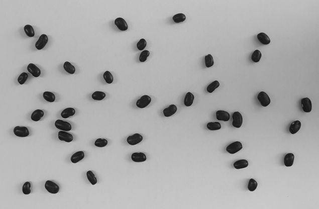

# Beans Counting


<br><br>


> This project involves counting beans in images using image processing techniques. It was developed as part of the Image Processing course at Universidade Federal de Alfenas (UNIFAL-MG).

## 📂 Project Structure

- **`contafeijao.py`**: Main script that implements the bean counting algorithm.
- **`beans/`**: Directory containing sample images of beans.
- **`desc/`**: Complete assignment description and example image.
  
## 🛠️ Dependencies

- Python 3
- NumPy
- Matplotlib

## 🚀 Getting Started

To get a local copy up and running, follow these simple steps:

1. **Clone the repository**:
    ```sh
    git clone https://github.com/giovananog/beans-counting.git
    ```
2. **Navigate to the project directory**:
    ```sh
    cd beans-counting
    ```
3. **Install the required libraries**:
    ```sh
    pip install numpy matplotlib
    ```
4. **Run the bean counting script**:
    ```sh
    python contafeijao.py <image_name.pgm>
    ```

## 🖥️ How It Works

1. The user provides a PGM image containing beans.
2. The `contafeijao.py` script processes the image using various image processing techniques such as thresholding, erosion, dilation, and connected component labeling.
3. The script counts the number of beans in the image and prints the result.

## 📊 Algorithm Details

- **Thresholding**: Converts the grayscale image to a binary image by setting a threshold value.
- **Erosion**: Removes small white noise and separates individual beans that are connected.
- **Dilation**: Restores the size of beans after erosion.
- **Labeling**: Uses a union-find algorithm to label connected components in the binary image and count the number of beans.
